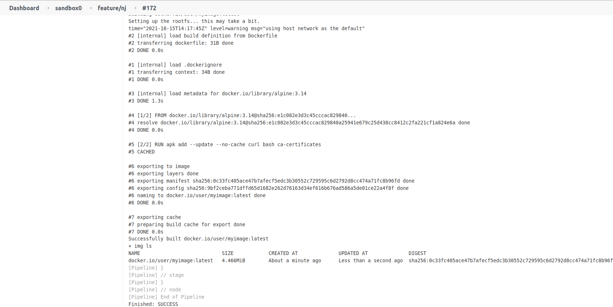

#### Jankins Agent with Img builder tool
# 
##### Usage in Kubernetes ([Kubernetes Jenkins Plugin](https://plugins.jenkins.io/kubernetes/))
```
---
spec:
  containers:
  -  name: "jnlp"
     securityContext:
       privileged: true
---
container.seccomp.security.alpha.kubernetes.io/jnlp: unconfined
container.apparmor.security.beta.kubernetes.io/jnlp: unconfined
---
Work Directory: /home/jenkins
Arguments: ${computer.jnlpmac} ${computer.name} 
Image: alphaceti/jenkins-agent:0.0.2
Container name: jnlp
Run As User ID: 1000
Run As Group ID: 1000
```
##### Tools

[Img](https://github.com/genuinetools/img) Standalone, root-less, unprivileged Dockerfile and OCI compatible container image builder.

<a href="./img/Jenkins.png"></a>
